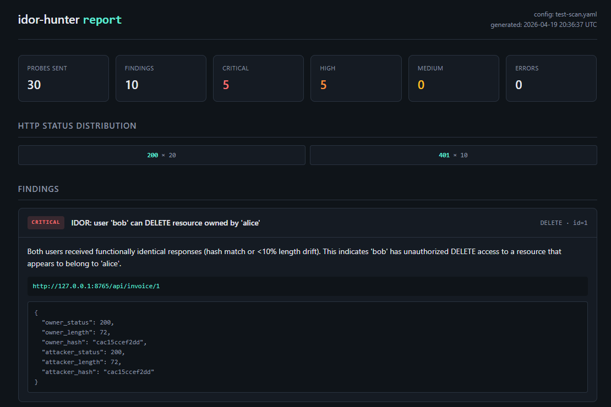

# idor-hunter

> Automated IDOR enumeration and permission-anomaly detection for authorized web-app security testing.

[](https://github.com/11lunaric11/idor-hunter/actions)
[](https://www.python.org/)
[](LICENSE)

`idor-hunter` iterates object IDs across an API, replays each request as multiple users (and unauthenticated), diffs the responses, and flags access-control anomalies that look like Insecure Direct Object References (IDORs).

It is **not** a fuzzer. It is a focused tool for the one thing that catches ~80% of real-world horizontal privilege-escalation bugs: *"does user B get a meaningful response for an ID that only belongs to user A?"*

**Battle-tested:** see [the Corridor writeup](WRITEUP-corridor.md) for a real-world run, including a false-positive I discovered by dogfooding (filed as [#2](https://github.com/11lunaric11/idor-hunter/issues/2), fixed in v0.3).

## Sample output



10 findings (5 critical, 5 high) from a scan against a deliberately vulnerable test API. A full demo report (built from synthetic data, showcases every finding type with realistic evidence) lives at [`examples/sample-report/report.html`](examples/sample-report/report.html).

---

## ⚠️ Authorized testing only

This tool is for use on targets where you have **explicit written authorization** to perform security testing (bug bounty programs with an in-scope declaration, CTFs like TryHackMe / HackTheBox, your employer's staging systems, your own applications). Scanning systems you don't own or aren't authorized to test is illegal in most jurisdictions. You are responsible for how you use this.

---

## Install

```bash
git clone https://github.com/11lunaric11/idor-hunter.git
cd idor-hunter
pip install -e .
```

Or with dev dependencies for running the test suite:

```bash
pip install -e ".[dev]"
pytest
```

## Quick start

```bash
# 1. Copy an example config and fill in your cookies
#    Start with basic.yaml (single user) or multi-user.yaml (two-account IDOR)
cp examples/multi-user.yaml my-scan.yaml
$EDITOR my-scan.yaml

# 2. Run
idor-hunter -c my-scan.yaml -o ./results

# 3. Open results/report.html in your browser
```

What a run looks like:

```
$ idor-hunter -c my-scan.yaml -o ./results

  _       __                __               __
 (_)___/ /___  _____      / /_  __  ______  / /____  _____
/ / __  / __ \/ ___/_____/ __ \/ / / / __ \/ __/ _ \/ ___/
/ / /_/ / /_/ / /  /_____/ / / / /_/ / / / / /_/  __/ /
___/\__,_/\____/_/       /_/ /_/\__,_/_/ /_/\__/\___/_/
        automated IDOR enumeration — authorized testing only

  target:  http://target.local
  users:   2
  scans:   1
  probes:  ~30
  scanning [██████████████████████████████] 30/30 (100.0%)

  probes:    30
  findings:  10
    critical 5
    high     5

  wrote to: results/
    → report.html
    → findings.json
    → probes.csv
```

The CLI writes three artifacts:

| File | What it is |
|------|-----------|
| `report.html` | Human-readable report, self-contained, share with the client |
| `findings.json` | Machine-readable findings for piping into other tools |
| `probes.csv` | Every single request/response — grep it, pivot it, keep it for evidence |

### Exit codes

The tool follows a strict exit-code contract so you can wire it into CI:

| Code | Meaning |
|------|---------|
| `0` | Scan ran clean — no `critical` or `high` findings |
| `1` | Scan produced at least one `critical` or `high` finding |
| `2` | Setup error — bad config, zero probes, or all probes errored (target unreachable) |

Exit `2` distinguishes "the scan didn't really run" from "the scan ran and found nothing." Critical for CI: a VPN drop or cookie expiry won't silently pass as a clean run.

### CLI flags

```
idor-hunter -c CONFIG [-o OUT_DIR] [--harvest|--no-harvest] [--no-html] [--no-csv] [--quiet]
```

| Flag | Effect |
|------|--------|
| `-c, --config` | Path to YAML scan config (required) |
| `-o, --out-dir` | Output directory (default: `./idor-results`) |
| `--harvest` / `--no-harvest` | After first pass, extract UUIDs from response bodies and replay them as a second pass. Overrides config's `harvest_ids` setting. |
| `--no-html` / `--no-csv` | Skip HTML report or CSV probe dump |
| `--quiet` | Suppress banner and progress bar |

---

## Methodology

The tool codifies the manual IDOR-hunting workflow. If you understand *why* it asks for what it asks for, you'll get better results.

### The core insight

Access-control bugs aren't found by looking at a single response. They're found by **comparing** responses. Specifically, by comparing:

1. **Across users** — does user B get A's data?
2. **Across auth states** — does the unauthenticated request get *any* data?
3. **Across HTTP verbs** — is `GET /foo/123` denied but `PUT /foo/123` allowed?

A scanner that looks at responses in isolation can only ever flag obvious stuff (500s, stack traces). Cross-referencing is what surfaces the subtle bugs.

### The four checks

**Check 1 — Cross-user content match (the classic IDOR).**
For each `(endpoint, id)` pair, the scanner fires the request as the baseline user (who should own the resource) and as each test user. If a test user gets back a response that matches the baseline's — identical SHA-1, or length within 10% to tolerate CSRF tokens and timestamps — that's an IDOR. Severity is `high` for `GET`, `critical` for write verbs.

**Check 2 — Unauthenticated access.**
When the scan contains at least one authenticated identity, an unauthenticated request that returns a substantive 200 response signals the auth middleware is missing. This catches "we forgot to add `@requires_auth` to this route."

If the scan has *no* authenticated identity (e.g. CTF hash-guessing rooms, or targets where you just want a structured sweep), Check 2 is silently skipped and a single `no_auth_baseline` info-level notice is emitted. Firing `unauth_access` on every 200 in that context is a false-positive flood — discovered during the [Corridor run](WRITEUP-corridor.md) and fixed in v0.3.

**Check 3 — Write-without-read.**
For write verbs (`PUT`, `PATCH`, `DELETE`, `POST`), the analyzer cross-references the same user's `GET` for the same ID. If `GET` returned 403 but `PUT` succeeded, the write path skipped the ownership check — a critical privilege-escalation seam. This is a surprisingly common pattern in frameworks where `@requires_ownership` is only applied to read views.

**Check 4 — Redirect matching.**
Some apps don't return data bodies for denied requests — they 302 to `/login`, `/forbidden`, or similar. If the baseline user's 302 target matches the test user's 302 target (same `Location` header), both are being routed to the same destination regardless of ownership, which often indicates the same underlying resource was accessed. Works as a companion to Check 1: content match *or* redirect match flags the finding.

### Session-expiry detection (v0.3+)

Separate from the checks above, the analyzer runs a post-scan heuristic per authenticated user: if an authed user's denial rate matches the unauthenticated baseline (both 90%+, less than 5% delta, ≥10 probes, zero successful authenticated responses), their session cookie probably died mid-scan. Emitted as a `session_expired` medium-severity finding so the subsequent zero-finding output doesn't silently masquerade as clean.

### Why two users, not one

Scanning with a single account can only catch unauthenticated leaks and trivially broken endpoints. The high-signal bugs are horizontal: Alice can read Bob's data. You need both accounts, and you need Alice to have created some resources first so you have real IDs to point Bob at. The [`multi-user.yaml`](examples/multi-user.yaml) example shows this workflow; [`basic.yaml`](examples/basic.yaml) is the simpler starting point.

### Why numeric AND UUID support

If the app uses incrementing integer IDs, a range sweep finds everything. If the app uses UUIDs, you can't enumerate them — but you can:

- Harvest them from other sources (URLs shared in emails, IDs returned by *other* API calls, references in the JS bundle) and drop them into `ids.type: list`
- Run with `--harvest`, which scans first-pass responses for UUIDs and automatically replays every discovered one against all test users. This catches IDORs against resources your config didn't know existed.

### Resume (v0.3+)

Long scans crash. Networks flake. Ctrl+C happens. With `options.resume: true`, every probe is appended to `probes.jsonl` as it lands, and on rerun the tool reads the log and skips any `(scan, user, method, id)` tuple already completed. The progress bar reflects the remaining work, not the total. Rerunning a finished scan is a no-op.

### What it deliberately doesn't do

- **No brute-force** — it's a diffing tool, not a fuzzer. Use `ffuf` / `wfuzz` for wordlist-based content discovery.
- **No exploitation** — findings describe the anomaly, they don't dump victim data or modify records (beyond the probe requests themselves).
- **No auth flow automation** — you paste in session cookies or bearer tokens. Handling every custom login flow is a rabbit hole; capturing a session in Burp and dropping it in YAML takes 30 seconds.
- **No CAPTCHA bypass**, no proxy rotation, none of that. Tool stays in its lane.
- **No authentication-bypass header probes** (`X-Forwarded-For`, `X-Original-URL`, etc.). That's a different vulnerability class with different semantics; mixing it into an IDOR tool would dilute the signal. Use a dedicated authz-bypass tool alongside this one.

### Known gaps

These are bugs and missing features, as opposed to the scope decisions above. Each one is a candidate for a future release.

- **Rate-limited APIs** may return 429s that look like denials. Tune `options.rate_limit` down.
- **Idempotent write verbs** — `PUT` and `DELETE` *actually modify things*. Only enable them on test data you don't care about, or on a staging clone. The tool won't stop you from DELETE-ing production records; that's on you.
- **Length-drift heuristic** (10% tolerance) occasionally flags legitimately-different-but-similar responses as matches. Review findings, don't rubber-stamp them. The report surfaces the exact hashes and lengths so you can check.
- **No JS rendering.** This tool hits HTTP endpoints directly. For SPA-heavy apps you still need to reverse-engineer the API from the network tab first.
- **Small-response blind spot.** Responses under ~50 bytes are treated as errors/empty and won't trigger findings. If you're testing an API with minimal JSON payloads, lower the `_SUBSTANTIVE_LENGTH` constant in `idor_hunter/analyzer.py`.
- **Destructive verbs = inferred impact.** For `DELETE`/`PUT`, identical cross-user responses indicate a missing authz check but don't *confirm* the resource was mutated. Verify impact manually before reporting.
- **No auto session refresh.** The analyzer detects expired sessions (see above) and emits `session_expired`, but it can't re-issue the cookie for you. Re-run with fresh auth.
- **Harvesting is UUID-only.** `--harvest` replays UUIDs found in response bodies but does not harvest numeric IDs (regex-based numeric extraction produces too much noise — amounts, timestamps, zip codes match the pattern).
- **No nested path placeholders yet.** `/api/user/{user_id}/invoice/{id}` (multiple IDs per endpoint) isn't supported; the tool currently iterates a single `{id}` per scan. On the roadmap for a future release.

---

## Config reference

Full config schema, all fields optional unless marked required:

```yaml
target:
  base_url: "http://target.local"    # REQUIRED

auth:
  users:                              # each user is an identity to probe as
    - name: alice                     # REQUIRED (referenced by scans)
      cookies:
        session: "..."
      headers:
        Authorization: "Bearer ..."
        X-CSRF-Token: "..."

scans:                                # REQUIRED, at least one
  - name: "invoice enumeration"       # REQUIRED, shows up in the report
    endpoint: "/api/invoice/{id}"     # REQUIRED, must contain {id}
    methods: [GET, PUT, DELETE]       # default: [GET]
    ids:                              # REQUIRED
      type: numeric                   # or "list"
      range: [1, 500]                 # for numeric
      # values: ["uuid-a", "uuid-b"]  # for list
    baseline_user: alice              # the "owner" — optional if only testing unauth
    test_users: [bob, carol]          # users who should NOT have access
    include_unauth: true              # also fire with no auth (default: true)
    body:                             # for POST/PUT/PATCH
      some: field

options:
  rate_limit: 10        # req/sec (0 = unlimited, default 10)
  timeout: 10           # seconds
  resume: false         # crash-safe resume: append probes.jsonl, skip done on rerun
  verify_tls: true      # set false for self-signed certs in labs
  max_retries: 2        # per-request retry on network errors
  harvest_ids: false    # enable UUID harvesting (also via --harvest CLI flag)
```

---

## Output format

### findings.json

```json
{
  "generated_at": "2026-04-19T20:15:00+00:00",
  "findings": [
    {
      "severity": "critical",
      "kind": "unauth_access",
      "title": "Unauthenticated access to GET invoice enumeration",
      "description": "The endpoint returned a 200 with 1247 bytes ...",
      "scan": "invoice enumeration",
      "method": "GET",
      "url": "http://target.local/api/invoice/42",
      "id": "42",
      "evidence": { "status": 200, "length": 1247, "hash": "a1b2c3...", "preview": "..." }
    }
  ]
}
```

### Finding kinds

| Kind | Severity | Meaning |
|------|----------|---------|
| `unauth_access` | critical | Endpoint serves data to unauthenticated clients (scan had an authed baseline for comparison) |
| `idor_write` | critical | Non-owner can `PUT`/`DELETE`/`PATCH`/`POST` owner's resource |
| `write_without_read` | critical | Write succeeds for a user whose read returns 403 |
| `idor_read` | high | Non-owner can `GET` owner's resource (content or redirect match) |
| `session_expired` | medium | Authed user's denial rate matches the unauth baseline mid-scan — cookie probably died |
| `no_auth_baseline` | info | Scan had no authenticated identity, so Check 2 was skipped |

Harvested IDs (from `--harvest`) surface as regular findings above, with the originating probe tracked in the `discovered_via` field of the underlying probe record.

---

## Real-world use

- [**Corridor (TryHackMe)**](WRITEUP-corridor.md) — walkthrough of using idor-hunter to solve a hash-guessing challenge. Includes a false-positive bug I discovered in my own tool, filed as [#2](https://github.com/11lunaric11/idor-hunter/issues/2), and fixed in v0.3.0.
- [**User ID controlled by request parameter (PortSwigger)**](WRITEUP-portswigger-user-id.md) — second real target. Tool flagged the vulnerability correctly via `unauth_access` — a different check than I expected. Lab is misdesigned: advertises IDOR, actually has no auth at all.

---

## Development

```bash
# Install with dev deps
pip install -e ".[dev]"

# Run tests (40 cases, across Python 3.10 / 3.11 / 3.12 in CI)
pytest

# Lint
ruff check .

# Run a scan against a local test target
python -m idor_hunter -c examples/basic.yaml -o ./out
```

The project is laid out so the pieces are swappable:
- `scanner.py` only does I/O — produces `Probe` records
- `analyzer.py` only consumes `Probe` records — produces `Finding` records
- `reporter.py` only consumes `Finding` records — produces files
- `harvester.py` extracts replay candidates from probe responses

Want to add a check? Add a function in `analyzer.py`. Want to add an output format? Add a writer in `reporter.py`. The data contract between layers is stable.

## Changelog

See the [releases page](https://github.com/11lunaric11/idor-hunter/releases) for version history.

---

## License

MIT — see [LICENSE](LICENSE).

## Acknowledgements

- OWASP's [Testing for IDOR](https://owasp.org/www-project-web-security-testing-guide/) guide
- PortSwigger's [Authorize](https://portswigger.net/bappstore/f9bbac8c4acf4aefa4d7dc92a991af2f) Burp extension, which does this workflow interactively and inspired the two-user diff approach